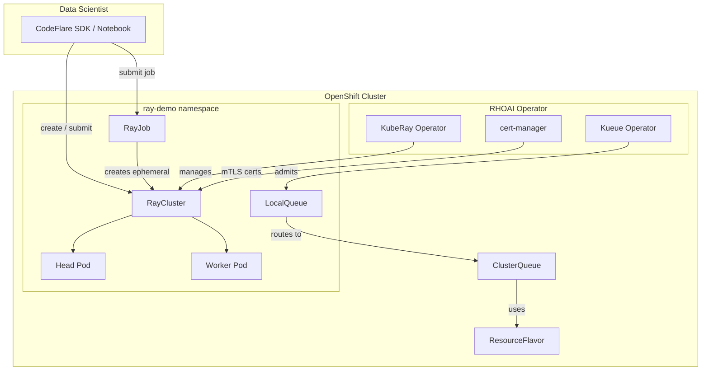

# KubeRay on Red Hat OpenShift AI 3.4

[](https://docs.openshift.com/)
[](https://docs.redhat.com/en/documentation/red_hat_openshift_ai_self-managed/3.4)
[](https://github.com/ray-project/kuberay)
[](https://kueue.sigs.k8s.io/)
[](LICENSE)

A hands-on workshop for deploying and running distributed Ray workloads on Red Hat OpenShift AI using KubeRay and Kueue. Covers the full stack from platform administrator setup to data scientist usage via the CodeFlare SDK.

---

## Architecture



## Tested On

| Component | Version |
|-----------|---------|
| OpenShift Container Platform | 4.18+ |
| Red Hat OpenShift AI | 3.4.1 |
| KubeRay Operator | 1.4.2 (RHOAI-managed) |
| Red Hat build of Kueue | 1.2 |
| cert-manager Operator | stable |
| Ray Image | `quay.io/modh/ray:2.47.1-py311-cu121` |

## Quick Start

### 1. Platform Setup (Admin)

```bash
# Enable KubeRay and Kueue in RHOAI
oc apply -k manifests/platform/

# Create the demo namespace and Kueue queue
oc apply -k manifests/base/
```

### 2. Deploy a RayCluster

```bash
# Deploy the cluster
oc apply -k manifests/raycluster/

# Apply the AuthenticationReady workaround (required for RHOAI 3.4.1)
./scripts/fix-auth.sh ray-demo demo-cluster

# Verify
oc get raycluster -n ray-demo
oc get pods -n ray-demo
```

### 3. Test the Cluster

```bash
./scripts/test-cluster.sh ray-demo demo-cluster
```

### 4. Submit a RayJob

```bash
# Ephemeral job (creates its own cluster, cleans up after)
oc apply -k manifests/rayjob-ephemeral/
./scripts/fix-auth.sh ray-demo  # fix auth on the child cluster

# Or use the full deployment script
./scripts/deploy.sh
```

## Workshop Modules

| Module | Topic | Audience |
|--------|-------|----------|
| [01 - Overview](docs/01-overview.md) | What is KubeRay, architecture, RHOAI integration | Everyone |
| [02 - Prerequisites](docs/02-prerequisites.md) | Cluster requirements, operator installations | Admin |
| [03 - Platform Setup](docs/03-platform-setup.md) | DataScienceCluster, Kueue configuration | Admin |
| [04 - RayCluster](docs/04-raycluster.md) | Deploy and verify a Ray cluster | Admin / DS |
| [05 - RayJob](docs/05-rayjob.md) | Submit ephemeral and existing-cluster jobs | Admin / DS |
| [06 - CodeFlare SDK](docs/06-codeflare-sdk.md) | Python SDK workflows from Jupyter notebooks | Data Scientist |
| [07 - Troubleshooting](docs/07-troubleshooting.md) | Known issues, workarounds, recovery procedures | Admin |

## Repository Structure

```
rhoai-kuberay/
├── docs/                        # Workshop documentation
├── manifests/
│   ├── base/                    # Namespace + LocalQueue (Kustomize base)
│   ├── platform/                # Admin: DSC patch, ClusterQueue, ResourceFlavor
│   ├── raycluster/              # RayCluster + kube-rbac-proxy ConfigMap
│   ├── rayjob-ephemeral/        # Fire-and-forget RayJob
│   └── rayjob-existing/         # RayJob targeting existing cluster
├── scripts/                     # Deployment, workaround, and test scripts
├── notebooks/                   # CodeFlare SDK Jupyter notebooks
├── LICENSE
└── README.md
```

## Key References

- [RHOAI 3.4 - Installing Distributed Workloads](https://docs.redhat.com/en/documentation/red_hat_openshift_ai_self-managed/3.4/html/installing_and_uninstalling_openshift_ai_self-managed/installing-the-distributed-workloads-components_install)
- [RHOAI 3.4 - Managing Distributed Workloads](https://docs.redhat.com/en/documentation/red_hat_openshift_ai_self-managed/3.4/html/managing_openshift_ai/managing-distributed-workloads_managing-rhoai)
- [RHOAI 3.4 - Running Ray-based Workloads](https://docs.redhat.com/en/documentation/red_hat_openshift_ai_self-managed/3.4/html/working_with_distributed_workloads/running-ray-based-distributed-workloads_distributed-workloads)
- [Red Hat Developer - Tame Ray workloads with KubeRay and Kueue](https://developers.redhat.com/articles/2025/12/03/tame-ray-workloads-openshift-ai-kuberay-and-kueue)
- [CodeFlare SDK](https://github.com/project-codeflare/codeflare-sdk)
- [KubeRay Upstream](https://github.com/ray-project/kuberay)

## License

This project is licensed under the Apache License 2.0 - see the [LICENSE](LICENSE) file for details.
