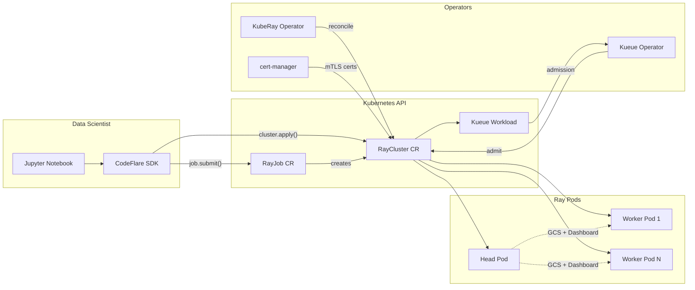

# Module 1: Overview

## What Are Distributed Workloads?

Distributed workloads allow you to queue, scale, and manage the resources required to run data science workloads across multiple nodes in an OpenShift cluster simultaneously. This enables:

- **Faster iteration** through reduced processing time across multiple nodes
- **Larger datasets** that would not fit on a single node
- **Complex models** that require multi-node training (e.g., large language models)
- **Automatic scheduling** -- submit workloads at any time and the system schedules them when resources are available

## KubeRay on RHOAI

Red Hat OpenShift AI (RHOAI) integrates KubeRay as a managed component. Instead of installing the upstream KubeRay operator directly, RHOAI deploys and manages it through the `DataScienceCluster` custom resource.

### Component Stack

| Component | Role | Managed By |
|-----------|------|------------|
| **KubeRay Operator** | Manages RayCluster, RayJob, and RayService lifecycle | RHOAI operator (`ray: Managed`) |
| **Red Hat build of Kueue** | Quota-aware workload admission and queueing | Standalone operator (`kueue: Unmanaged`) |
| **cert-manager Operator** | TLS certificate automation for mTLS between Ray nodes | Standalone operator |
| **CodeFlare SDK** | Python SDK for data scientists to create Ray clusters and submit jobs | Pre-installed in RHOAI workbench images |

### KubeRay Custom Resource Definitions

| CRD | Purpose | Lifecycle |
|-----|---------|-----------|
| `RayCluster` | Defines a Ray cluster (1 head + N workers). KubeRay manages pod creation, autoscaling, and fault tolerance. | Long-lived or ephemeral |
| `RayJob` | Wraps a Ray program submission. Can create an ephemeral RayCluster or target an existing one. | Job-scoped |
| `RayService` | Combines a RayCluster with a Ray Serve deployment for inference serving with zero-downtime upgrades. | Long-lived |

### Kueue Custom Resource Definitions

| CRD | Purpose | Scope |
|-----|---------|-------|
| `ResourceFlavor` | Defines a hardware variation (CPU-only, GPU type, node labels) | Cluster |
| `ClusterQueue` | Global resource pool with quotas and admission policies | Cluster |
| `LocalQueue` | Namespaced entry point that routes workloads to a ClusterQueue | Namespace |

## How It Fits Together

## Three Workflows

This workshop covers the three primary workflows described in the [Red Hat Developer article](https://developers.redhat.com/articles/2025/12/03/tame-ray-workloads-openshift-ai-kuberay-and-kueue):

1. **Long-running RayCluster** -- A persistent workspace for interactive development. Ideal for prototyping, exploratory analysis, and connecting to live systems.

2. **Quick-iteration RayJob** -- Submit jobs to your existing workspace cluster for fast feedback. No cluster startup wait.

3. **Ephemeral RayJob** -- Fire-and-forget. The operator creates a temporary cluster, runs the job, and tears down the infrastructure automatically.

---

**Next:** [Module 2 - Prerequisites](02-prerequisites.md)
