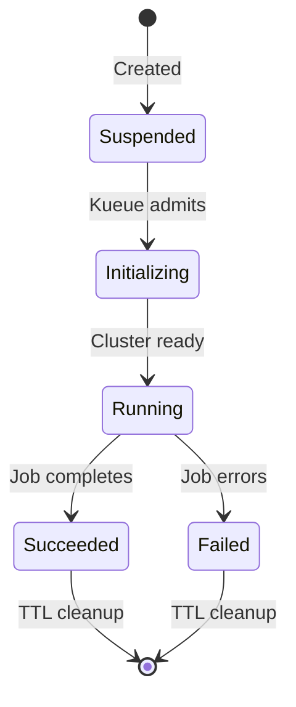
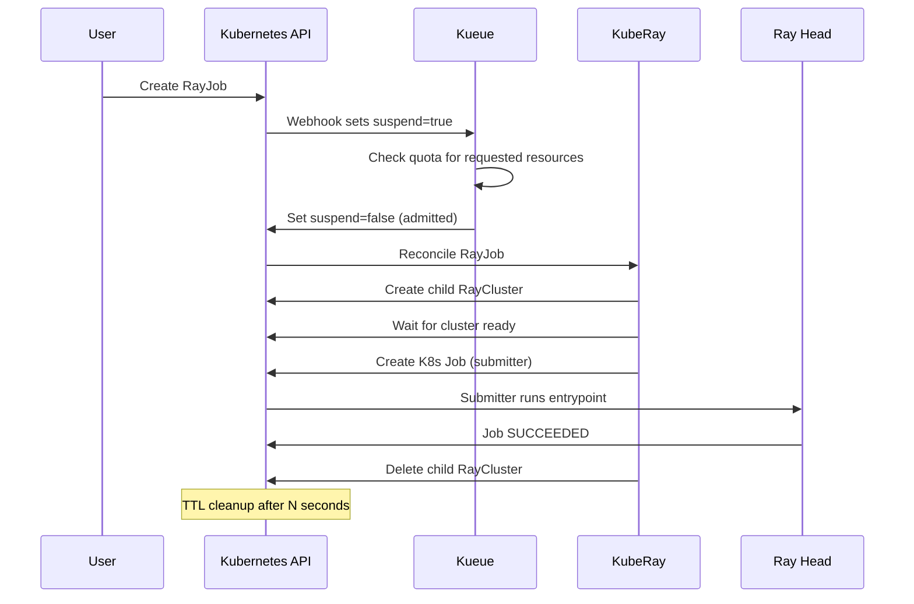

# Module 5: Submitting RayJobs

## Learning Objectives

By the end of this module you will understand:

- The difference between ephemeral and existing-cluster RayJobs
- How `submissionMode` controls job delivery to the Ray head
- The Kueue suspend/admit lifecycle for RayJobs
- When to use each workflow and the trade-offs involved

## Concept: What is a RayJob?

A `RayJob` is a Kubernetes custom resource that combines **cluster lifecycle** with **job execution**. Instead of manually creating a RayCluster, submitting a script, and tearing down the cluster, a RayJob does all three in one declaration.



## Concept: Submission Modes

| Mode | How it works | When to use |
|------|-------------|-------------|
| **K8sJobMode** | KubeRay creates a Kubernetes `Job` that runs the entrypoint inside a submitter pod. The pod connects to the Ray head and submits the work. | Default and recommended. Works reliably with mTLS. |
| **HTTPMode** | KubeRay submits the entrypoint directly to the Ray dashboard's HTTP API. | Simpler but requires dashboard to be accessible and authenticated. |

:::info Why K8sJobMode is the default
In RHOAI, mTLS is enabled between all Ray nodes. A Kubernetes Job pod automatically gets the same TLS volume mounts and environment variables as the Ray pods, so it can authenticate to the head. HTTP submission would require separate dashboard authentication setup.
:::

## Concept: Kueue Lifecycle for RayJobs

When you create a RayJob with an inline `rayClusterSpec`, Kueue manages the full lifecycle:



## Workflow 1: Ephemeral RayJob (Fire-and-Forget)

This is the recommended pattern for batch workloads. The cluster is created for the job and destroyed after.

### Deploy

```bash
oc apply -k manifests/rayjob-ephemeral/
```

:::warning AuthenticationReady workaround
The RayJob creates a **child RayCluster** that needs the same auth fix as a standalone cluster. Wait for the child cluster name to appear, then run:

```bash
CHILD=$(oc get rayjob demo-rayjob-ephemeral -n ray-demo \
  -o jsonpath='{.status.rayClusterName}')
./scripts/fix-auth.sh ray-demo "$CHILD"
```
:::

### Key Fields

```yaml
spec:
  submissionMode: K8sJobMode       # use K8s Job for submission
  shutdownAfterJobFinishes: true   # delete cluster when job ends
  ttlSecondsAfterFinished: 300     # clean up RayJob CR after 5 min
  entrypoint: "python -c '...'"    # the Ray program to execute
  rayClusterSpec:                  # inline cluster definition
    rayVersion: '2.47.1'
    headGroupSpec: ...
    workerGroupSpecs: ...
```

### Monitor

```bash
# Watch job progress
oc get rayjob -n ray-demo -w
```

Expected output progression:

```
NAME                    JOB STATUS   DEPLOYMENT STATUS   RAY CLUSTER NAME         AGE
demo-rayjob-ephemeral                Initializing        demo-rayjob-eph-xxxxx    10s
demo-rayjob-ephemeral   RUNNING      Running             demo-rayjob-eph-xxxxx    2m
demo-rayjob-ephemeral   SUCCEEDED    Complete            demo-rayjob-eph-xxxxx    3m
```

```bash
# View job logs (from the K8s Job submitter pod)
oc logs -n ray-demo -l batch.kubernetes.io/job-name --tail=20
```

## Workflow 2: RayJob on Existing Cluster

Submit a job to a running RayCluster for fast iteration. No cluster startup latency.

### Prerequisites

A running `demo-cluster` in `ray-demo` (see [Module 4](04-raycluster)).

### Deploy

```bash
oc apply -k manifests/rayjob-existing/
```

### Key Differences

| | Ephemeral | Existing Cluster |
|---|---|---|
| **Cluster creation** | Automatic (inline spec) | Must pre-exist |
| **Startup latency** | 2-5 minutes (image pull + boot) | Seconds |
| **`shutdownAfterJobFinishes`** | `true` (required) | `false` |
| **`clusterSelector`** | Not used | `ray.io/cluster: demo-cluster` |
| **Kueue admission** | Full quota check on new cluster | Cluster already admitted |
| **Best for** | Batch jobs, nightly runs, CI/CD | Interactive development, testing |

:::tip When to use which
- **Prototyping?** Use an existing cluster. You are iterating quickly and do not want to wait for cluster boot.
- **Production batch?** Use ephemeral. Zero idle waste -- the cluster exists only while the job runs.
- **Shared team cluster?** Use existing. Multiple data scientists submit jobs to the same workspace cluster.
:::

## Troubleshooting RayJobs

### Job stuck at "Initializing" with 0 pods

The child RayCluster cannot start. Common causes:

1. **AuthenticationReady** not set -- run `./scripts/fix-auth.sh`
2. **Insufficient resources** -- check `oc describe pod` for scheduling errors
3. **Image pull errors** -- verify the image tag exists

### Job shows no status (empty JOB STATUS and DEPLOYMENT STATUS)

The RayJob is suspended by Kueue. Check:

```bash
oc get rayjob <name> -n ray-demo -o jsonpath='{.spec.suspend}'
```

If `true`, verify your `LocalQueue` and `ClusterQueue` are correctly configured and have available quota.

### "shutdownAfterJobFinishes set to false is not allowed to be suspended"

This error means you tried to use `shutdownAfterJobFinishes: false` (existing cluster mode) while Kueue suspended the job. Kueue cannot manage the lifecycle of a job that does not own its cluster. Solutions:

- Set `suspend: false` explicitly in the spec
- Or use `shutdownAfterJobFinishes: true` with an inline cluster spec

## Deep Dive

- [KubeRay RayJob documentation](https://docs.ray.io/en/latest/cluster/kubernetes/getting-started/rayjob-quick-start.html)
- [Red Hat Developer -- Tame Ray workloads with KubeRay and Kueue](https://developers.redhat.com/articles/2025/12/03/tame-ray-workloads-openshift-ai-kuberay-and-kueue)

---

**Next:** [Module 6 -- CodeFlare SDK](06-codeflare-sdk)
