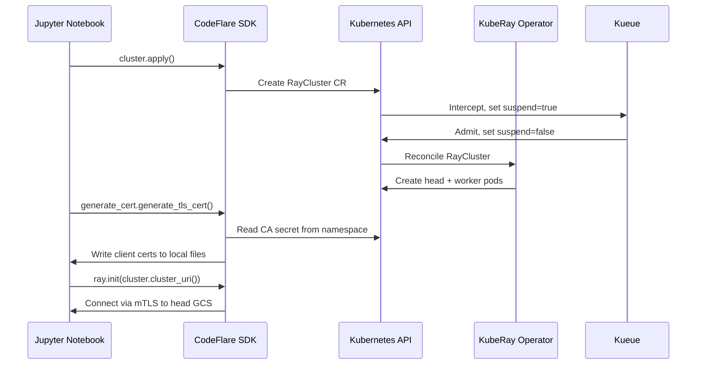

import Tabs from '@theme/Tabs';
import TabItem from '@theme/TabItem';

# Module 6: CodeFlare SDK (Data Scientist Workflow)

## Learning Objectives

By the end of this module you will understand:

- Why the SDK exists and what it generates under the hood
- The three SDK workflows (workspace cluster, quick-iteration, fire-and-forget)
- How mTLS certificate generation works and why it is required
- How to use the SDK from an RHOAI Workbench

## Concept: Why Use the SDK Instead of Raw YAML?

You could create RayClusters and RayJobs by writing YAML manifests. The CodeFlare SDK exists because **data scientists should not need to know Kubernetes.** The SDK:

1. **Abstracts YAML** -- `ClusterConfiguration(num_workers=2)` generates the full RayCluster spec
2. **Handles authentication** -- auto-detects your Kubernetes credentials when running inside a workbench
3. **Manages mTLS** -- generates TLS certificates so your notebook can connect to the secure Ray cluster
4. **Provides observability** -- `cluster.details()`, `cluster.status()`, and `view_clusters()` show cluster state without `kubectl`

### What happens under the hood



## Authentication in RHOAI Workbenches

The CodeFlare SDK needs Kubernetes credentials to create Ray clusters. How it gets them depends on where you run:

| Context | How auth works |
|---------|---------------|
| **Inside an RHOAI Workbench** | Credentials are auto-detected from the workbench's service account. No explicit auth code needed in most cases. |
| **Local machine / outside cluster** | Use token-based auth with `oc whoami -t` to get a bearer token, then pass it to the SDK. |

:::warning Known issue: RHOAIENG-46748
The workbench service account may lack the RBAC permissions needed for Ray operations. If you get a **403 Forbidden** error when creating clusters, ask your admin to grant Ray RBAC to your service account, or use token-based auth instead:

```python
from kube_authkit import AuthConfig, get_k8s_client
from codeflare_sdk import set_api_client

auth_config = AuthConfig(
    method="openshift",
    token="<your-token-from-oc-whoami-t>",
    server="<your-api-server-url>",
)
client = get_k8s_client(config=auth_config)
set_api_client(client)
```
:::

:::info SDK auth migration
The CodeFlare SDK is migrating from the older `TokenAuthentication` class to `kube-authkit` (`AuthConfig`, `set_api_client`). This workshop uses auto-detect for simplicity. See the [CodeFlare SDK authentication docs](https://project-codeflare.github.io/codeflare-sdk/) for the latest guidance.
:::

## Setting Up a Workbench

1. In the RHOAI Dashboard, navigate to **Data Science Projects**
2. Create or select a project (ensure it has `kueue.openshift.io/managed=true` label)
3. Click **Create workbench**
4. Select a notebook image that includes the CodeFlare SDK (e.g., **Standard Data Science**)
5. Launch the workbench and open JupyterLab

:::info Why image selection matters
The CodeFlare SDK is pre-installed in RHOAI workbench images. If you use a custom image, you need `pip install codeflare-sdk`. The Python version in the workbench image must also match the Ray cluster image (both should be Python 3.11 for `quay.io/modh/ray:2.47.1-py311-cu121`).
:::

> **Official reference:** [RHOAI 3.4 -- Running Ray-based distributed workloads from Jupyter notebooks](https://docs.redhat.com/en/documentation/red_hat_openshift_ai_self-managed/3.4/html/working_with_distributed_workloads/running-ray-based-distributed-workloads_distributed-workloads)

:::danger RHOAI 3.4.1: AuthenticationReady workaround required
On RHOAI 3.4.1, clusters created via the CodeFlare SDK will hang at `cluster.wait_ready()` due to the AuthenticationReady bug (see [Module 7 -- Troubleshooting](/docs/07-troubleshooting)). After running `cluster.apply()`, a cluster administrator must run the workaround script from a terminal:

```bash
# Get the cluster name from the SDK output, then run:
./scripts/fix-auth.sh <namespace> <cluster-name>
```

Only after this will `cluster.wait_ready()` complete. This applies to all three workflows below. Ephemeral RayJobs also need the fix on the child cluster they create.
:::

<Tabs>
<TabItem value="workspace" label="Workspace Cluster" default>

## Long-Running RayCluster

Create a persistent Ray cluster for interactive development:

```python
from codeflare_sdk import Cluster, ClusterConfiguration

cluster = Cluster(
    ClusterConfiguration(
        name="my-workspace",
        namespace="ray-demo",
        num_workers=2,
        worker_cpu_requests=1,
        worker_memory_requests=2,
        image="quay.io/modh/ray:2.47.1-py311-cu121",
        local_queue="default",
    )
)

cluster.apply()
cluster.wait_ready()
cluster.details()
```

### Connect with mTLS

RHOAI enables mTLS on all Ray clusters. To connect your notebook to the cluster, you must generate client certificates:

```python
from codeflare_sdk import generate_cert

generate_cert.generate_tls_cert(cluster.config.name, cluster.config.namespace)
generate_cert.export_env(cluster.config.name, cluster.config.namespace)
```

:::info What this does
1. Reads the CA certificate secret (`<cluster-name>-ca-secret-*`) from the namespace
2. Generates a client certificate signed by that CA
3. Sets `RAY_USE_TLS`, `RAY_TLS_SERVER_CERT`, `RAY_TLS_SERVER_KEY`, `RAY_TLS_CA_CERT` environment variables
4. Now `ray.init()` will use these certs to authenticate to the cluster
:::

```python
import ray

ray.init(cluster.cluster_uri())
print("Nodes:", len(ray.nodes()))

@ray.remote
def train(batch_id):
    import time
    time.sleep(2)
    return f"Batch {batch_id} trained"

results = ray.get([train.remote(i) for i in range(8)])
for r in results:
    print(r)
```

### Cleanup

```python
ray.shutdown()
cluster.down()  # deletes the RayCluster CR
```

</TabItem>
<TabItem value="quick" label="Quick-Iteration Job">

## Quick-Iteration RayJob

Submit a job to your existing workspace cluster -- no startup wait:

```python
from codeflare_sdk import RayJob

quick_job = RayJob(
    job_name="quick-dev-test",
    entrypoint="python test_model.py",
    cluster_name="my-workspace",
    namespace="ray-demo",
    runtime_env={
        "working_dir": ".",
        "pip": "requirements.txt",
    },
)

quick_job.submit()
quick_job.status()
quick_job.logs()
```

:::tip runtime_env
The `runtime_env` dictionary tells Ray to:
- `working_dir`: upload this directory to the cluster
- `pip`: install these Python packages on the workers before running

This means your workers do not need your code pre-installed in the image.
:::

</TabItem>
<TabItem value="ephemeral" label="Ephemeral Job">

## Ephemeral RayJob (Fire-and-Forget)

Create a job that provisions its own cluster and tears it down after:

```python
from codeflare_sdk import RayJob, ManagedClusterConfig

production_job = RayJob(
    job_name="training-run",
    namespace="ray-demo",
    local_queue="default",
    cluster_config=ManagedClusterConfig(
        num_workers=2,
        worker_cpu_requests=1,
        worker_cpu_limits=1,
        worker_memory_requests=2,
        worker_memory_limits=4,
    ),
    entrypoint="python train_model.py",
    runtime_env={
        "working_dir": ".",
        "pip": "requirements.txt",
    },
)

production_job.submit()
```

</TabItem>
</Tabs>

## Using the Built-in Demo Notebooks

RHOAI ships guided demo notebooks with the CodeFlare SDK:

```python
from codeflare_sdk import copy_demo_nbs
copy_demo_nbs()
```

This copies notebooks into `demo-notebooks/` in your workbench:

| Notebook | What it teaches |
|----------|----------------|
| `2_basic_interactive.ipynb` | Interactive use with mTLS authentication and cluster setup |
| `3_widget_example.ipynb` | Interactive browser controls for cluster management |

Additional demo notebooks may be available in the `additional-demos` folder. Run `copy_demo_nbs()` to see the full list for your SDK version.

## Managing Clusters and Accessing the Dashboard

The `view_clusters()` function is the primary way data scientists access the Ray dashboard in RHOAI:

```python
from codeflare_sdk import view_clusters
view_clusters()
```

This renders interactive controls directly in your notebook:

- **Select an existing cluster** -- toggle between clusters in your project
- **View cluster details** -- status, resources, node count (same as `cluster.details()`)
- **Open Ray Dashboard** -- opens the dashboard in a new browser tab via the gateway URL (`https://rh-ai.apps.<domain>/ray/<namespace>/<cluster-name>/`). Authentication is handled by the RHOAI gateway using your OpenShift credentials.
- **View Jobs** -- opens the Jobs tab in the Ray dashboard
- **Delete cluster** -- equivalent to `cluster.down()`
- **Refresh Data** -- updates the cluster list and details

You can also view clusters in other projects you have access to:

```python
view_clusters("another-project")
```

:::warning Known Issue: RHAIENG-1795
The Ray Dashboard Gateway route may not respond correctly when the cluster was created through CodeFlare. If the "Open Ray Dashboard" button does not work, use port-forwarding as a fallback:

```bash
HEAD_POD=$(oc get pods -n <namespace> -l ray.io/node-type=head -o name | head -1)
oc port-forward "$HEAD_POD" -n <namespace> 8265:8265
```

Then open http://localhost:8265. See [Module 7 -- Troubleshooting](07-troubleshooting) for details.
:::

> **Official reference:** [RHOAI 3.4 -- Managing Ray clusters from within a Jupyter notebook](https://docs.redhat.com/en/documentation/red_hat_openshift_ai_self-managed/3.4/html/working_with_distributed_workloads/running-ray-based-distributed-workloads_distributed-workloads#managing-ray-clusters-from-within-a-jupyter-notebook_distributed-workloads)

## Workshop Notebooks

This repository includes ready-to-use Jupyter notebooks that implement the workflows above:

| Notebook | Description |
|----------|-------------|
| [`01_create_cluster.ipynb`](https://github.com/rrbanda/rhoai-kuberay/blob/main/notebooks/01_create_cluster.ipynb) | Create a RayCluster with CodeFlare SDK, connect with mTLS, run distributed tasks |
| [`02_submit_rayjob.ipynb`](https://github.com/rrbanda/rhoai-kuberay/blob/main/notebooks/02_submit_rayjob.ipynb) | Submit ephemeral and existing-cluster RayJobs via the SDK |

Upload these to your RHOAI Workbench to follow along.

## Deep Dive

- [CodeFlare SDK documentation](https://project-codeflare.github.io/codeflare-sdk/)
- [CodeFlare SDK GitHub](https://github.com/project-codeflare/codeflare-sdk)
- [RHOAI 3.4 -- Running Ray-based distributed workloads](https://docs.redhat.com/en/documentation/red_hat_openshift_ai_self-managed/3.4/html/working_with_distributed_workloads/running-ray-based-distributed-workloads_distributed-workloads)
- [Red Hat Developer -- Tame Ray workloads with KubeRay and Kueue](https://developers.redhat.com/articles/2025/12/03/tame-ray-workloads-openshift-ai-kuberay-and-kueue)

---

**Next:** [Module 7 -- Troubleshooting](07-troubleshooting)
