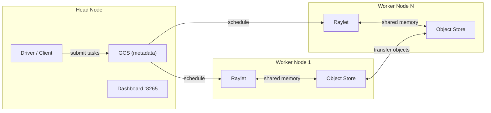
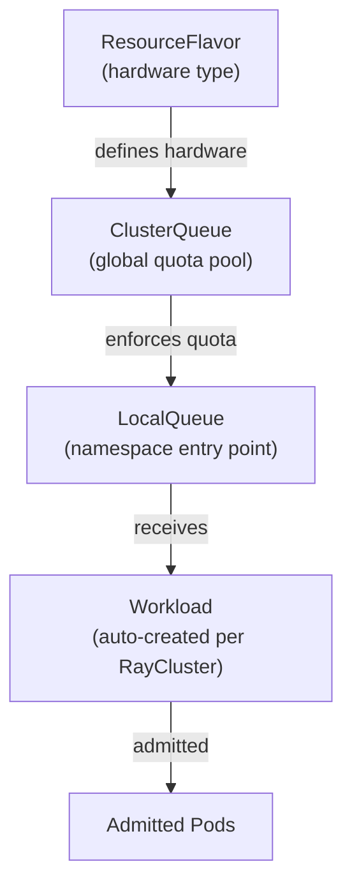

# Module 1: Overview

## Learning Objectives

By the end of this module you will understand:

- What problem distributed workloads solve and why Ray is the framework of choice
- How KubeRay, Kueue, and the CodeFlare SDK work together on RHOAI
- The key Custom Resource Definitions (CRDs) and what each one controls
- The three primary workflows available to data scientists

## What Problem Does Ray Solve?

Imagine you have a Python training script that takes 8 hours on your laptop. You could buy a bigger machine, but there is a ceiling. **Ray lets you distribute that same Python code across many machines with minimal changes.** A single `@ray.remote` decorator turns a function into a distributed task:

```python
import ray

@ray.remote
def train_partition(data_shard):
    # same code as before, but runs on a remote worker
    return model.fit(data_shard)

# fans out across all available workers automatically
futures = [train_partition.remote(shard) for shard in data_shards]
results = ray.get(futures)
```

Ray handles serialization, scheduling, fault tolerance, and data movement. You focus on the logic.

:::info Why not just use Kubernetes Jobs?
Kubernetes Jobs are single-process. Ray provides a **cluster runtime** -- shared memory (object store), a Global Control Service (GCS) for metadata, a dashboard, autoscaling, and actor-based state management. This is what makes multi-node ML training, hyperparameter tuning, and reinforcement learning practical.
:::

## Ray Cluster Architecture

A Ray cluster has two types of nodes:



| Component | Role |
|-----------|------|
| **GCS** (Global Control Service) | Centralized metadata store on the head node. Tracks node membership, resource availability, and actor locations. |
| **Raylet** | Per-node daemon that manages local task execution, object store, and resource reporting. |
| **Object Store** | Shared-memory plasma store on each node. Enables zero-copy data sharing between tasks on the same node and efficient transfer between nodes. |
| **Dashboard** | Web UI on port 8265 for monitoring jobs, actors, and cluster health. |

## How RHOAI Integrates Ray

On a vanilla Kubernetes cluster you would install the upstream KubeRay operator via Helm. **On RHOAI, the operator is managed for you** through the `DataScienceCluster` custom resource. This is important because:

1. RHOAI pins a tested version of KubeRay (currently 1.4.2)
2. It adds **mTLS** via cert-manager so all Ray inter-node traffic is encrypted
3. It injects a **kube-rbac-proxy** sidecar on the head pod to protect the Ray dashboard
4. It integrates with the **data-science-gateway** for authentication

The component stack:

| Component | What it does | How RHOAI manages it |
|-----------|-------------|---------------------|
| **KubeRay Operator** | Reconciles RayCluster, RayJob, RayService CRDs into pods, services, and network policies | Deployed when `ray: Managed` in the DataScienceCluster |
| **Red Hat build of Kueue** | Provides quota-aware admission -- holds workloads in a queue until resources are available | External operator; RHOAI sets `kueue: Unmanaged` to integrate |
| **cert-manager** | Generates and rotates TLS certificates for mTLS between Ray nodes | Standalone operator; KubeRay creates Certificate CRs automatically |
| **CodeFlare SDK** | Python library for data scientists to create clusters and submit jobs | Pre-installed in RHOAI workbench notebook images |

> **Official reference:** [RHOAI 3.4 -- Overview of distributed workloads](https://docs.redhat.com/en/documentation/red_hat_openshift_ai_self-managed/3.4/html/working_with_distributed_workloads/overview-of-distributed-workloads_distributed-workloads)

## Custom Resource Definitions

### KubeRay CRDs

| CRD | Purpose | Lifecycle |
|-----|---------|-----------|
| **RayCluster** | Defines a Ray cluster (1 head + N workers). KubeRay manages pod creation, autoscaling, and fault tolerance. | Long-lived or ephemeral |
| **RayJob** | Wraps a Ray program submission. Can create an ephemeral RayCluster or target an existing one. Supports automatic cluster teardown after job completion. | Job-scoped |
| **RayService** | Combines a RayCluster with a Ray Serve deployment for model inference serving with zero-downtime upgrades. | Long-lived |

### Kueue CRDs

Kueue implements a hierarchical resource model:



| CRD | Scope | Purpose |
|-----|-------|---------|
| **ResourceFlavor** | Cluster | Defines a hardware variation -- CPU-only nodes, GPU nodes with specific labels/tolerations |
| **ClusterQueue** | Cluster | Global resource pool with nominal quotas per flavor. Decides admission. |
| **LocalQueue** | Namespace | Namespaced entry point. Teams submit workloads here; Kueue routes them to the ClusterQueue for admission. |

:::tip Why the hierarchy?
This separation lets platform admins define **cluster-wide policies** (ClusterQueue) while giving each team a **self-service entry point** (LocalQueue). Teams never see or modify global quota -- they just submit to their LocalQueue.
:::

## Three Workflows

This workshop covers the three workflows described in the [Red Hat Developer article](https://developers.redhat.com/articles/2025/12/03/tame-ray-workloads-openshift-ai-kuberay-and-kueue):

### 1. Long-Running RayCluster (Interactive Workspace)

**Use case:** A data scientist needs a persistent multi-node environment for prototyping, exploratory analysis, or connecting to live systems.

**How it works:** The CodeFlare SDK creates a `RayCluster` CR. Kueue admits it when quota is available. The cluster stays running until explicitly deleted.

### 2. Quick-Iteration RayJob (Existing Cluster)

**Use case:** Your code moved from a notebook into a `.py` script. You want sub-second submission time for the "code-run-check" loop.

**How it works:** A `RayJob` CR with `clusterSelector` targets your running workspace cluster. No cluster startup wait.

### 3. Ephemeral RayJob (Fire-and-Forget)

**Use case:** Production batch jobs, nightly training runs, large-scale experiments.

**How it works:** A `RayJob` CR with inline `rayClusterSpec` tells KubeRay to create a temporary cluster, run the job, and delete the cluster when done. Zero idle waste.

---

**Next:** [Module 2 -- Prerequisites](02-prerequisites)
