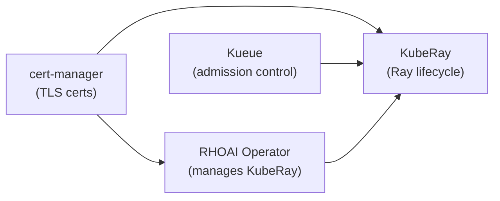

# Module 2: Prerequisites

## Learning Objectives

By the end of this module you will understand:

- Which operators are required and **why** each one is needed
- The version compatibility matrix
- How to verify your cluster is ready before proceeding

## Required Operators

Each operator in the stack has a distinct role. Installing them in the wrong order or skipping one causes subtle failures later.



### 1. Red Hat OpenShift AI Operator

| | |
|---|---|
| **Channel** | `fast-3.x` |
| **Namespace** | `redhat-ods-operator` |
| **Why it is needed** | This is the control plane. It manages the KubeRay operator deployment, injects mTLS configuration, adds the kube-rbac-proxy sidecar for dashboard security, and integrates with the data-science-gateway for authentication. Without it, you would need to install upstream KubeRay manually and handle all security configuration yourself. |

### 2. Red Hat build of Kueue Operator

| | |
|---|---|
| **Channel** | `stable` |
| **Namespace** | `openshift-kueue-operator` |
| **Why it is needed** | Without Kueue, Ray clusters start immediately and consume whatever resources they request -- first come, first served. On a shared cluster, this leads to resource starvation. Kueue provides **admission control**: workloads wait in a queue until the cluster has enough resources, and priorities determine which workloads run first. |

:::warning Managed vs Unmanaged
In the DataScienceCluster, Kueue must be set to `Unmanaged` (not `Managed`). The `Managed` state refers to an older embedded Kueue distribution that shipped inside RHOAI and **conflicts** with the standalone Red Hat build of Kueue operator. Setting it to `Unmanaged` tells RHOAI: "I have installed Kueue separately; integrate with it but do not deploy your own."
:::

### 3. cert-manager Operator for Red Hat OpenShift

| | |
|---|---|
| **Channel** | `stable` |
| **Namespace** | `cert-manager` |
| **Why it is needed** | Ray nodes communicate over gRPC. In a multi-tenant cluster, this traffic must be encrypted. cert-manager automates the TLS certificate lifecycle: the KubeRay operator creates `Certificate` custom resources, and cert-manager generates the actual TLS secrets that are mounted into Ray pods. Without it, Ray pod creation fails because the mTLS volume mounts reference secrets that do not exist. |

### 4. NVIDIA GPU Operator (Optional)

| | |
|---|---|
| **Channel** | `v25.x` |
| **Why it is needed** | Only required if you plan to use GPU-accelerated Ray workloads. It installs NVIDIA device drivers, the device plugin, and GPU monitoring. You also need the **Node Feature Discovery** operator to label GPU nodes. The GPU labels are then used in Kueue `ResourceFlavor` definitions to direct GPU workloads to the right nodes. |

## Version Compatibility

| Component | Tested Version | Notes |
|-----------|---------------|-------|
| OpenShift Container Platform | 4.19+ | Required by RHOAI 3.4 ([supported configs](https://access.redhat.com/articles/rhoai-supported-configs-3.x)) |
| Red Hat OpenShift AI | 3.4.1 | Manages KubeRay 1.4.2 |
| KubeRay Operator | 1.4.2 | Deployed by RHOAI, not installed directly |
| Red Hat build of Kueue | 1.2 | Standalone operator |
| cert-manager | stable | Required for mTLS certificates |
| Ray image | `quay.io/modh/ray:2.47.1-py311-cu121` | Python 3.11, CUDA 12.1 |

> **Official reference:** [RHOAI 3.4 -- Installing the distributed workloads components](https://docs.redhat.com/en/documentation/red_hat_openshift_ai_self-managed/3.4/html/installing_and_uninstalling_openshift_ai_self-managed/installing-the-distributed-workloads-components_install)

## CLI Tools

| Tool | Purpose | Install |
|------|---------|---------|
| `oc` | OpenShift CLI for all cluster operations | [Download](https://mirror.openshift.com/pub/openshift-v4/clients/ocp/stable/) |
| `ray` (optional) | Ray CLI for direct job submission and status | `pip install ray` |

## Verification

After installing the operators, verify they are running:

```bash
# RHOAI operator
oc get csv -n redhat-ods-operator | grep rhods

# Kueue operator
oc get pods -n openshift-kueue-operator | grep kueue

# cert-manager
oc get pods -n cert-manager
```

:::tip What to look for
All pods should be in `Running` state with `1/1` ready. If any pod is in `CrashLoopBackOff`, check its logs with `oc logs <pod-name> -n <namespace>` before proceeding.
:::

---

**Next:** [Module 3 -- Platform Setup](03-platform-setup)
