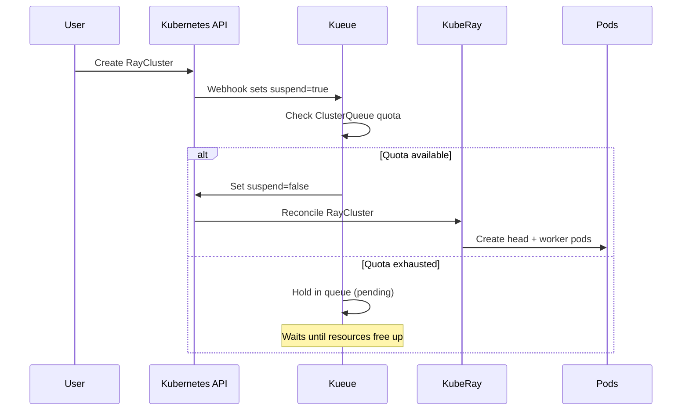

# Module 3: Platform Setup (Administrator)

## Learning Objectives

By the end of this module you will understand:

- How the `DataScienceCluster` controls which RHOAI components are active
- The meaning of `Managed`, `Unmanaged`, and `Removed` lifecycle states
- How Kueue's ResourceFlavor / ClusterQueue / LocalQueue hierarchy works
- Why namespace labels matter for Kueue admission

## Concept: DataScienceCluster Component Lifecycle

The `DataScienceCluster` (DSC) custom resource is the single control point for all RHOAI components. Each component has a `managementState` field with three possible values:

| State | Meaning |
|-------|---------|
| **Managed** | RHOAI deploys and manages this component. The operator creates the deployment, CRDs, RBAC, and keeps them reconciled. |
| **Unmanaged** | RHOAI integrates with this component but does **not** deploy it. You are responsible for installing it separately. Used for Kueue because the standalone Red Hat build of Kueue operator is more capable than the embedded version. |
| **Removed** | RHOAI does not deploy this component and does not integrate with it. If it was previously `Managed`, the operator removes the deployment. |

For KubeRay distributed workloads, you need:

```yaml
spec:
  components:
    ray:
      managementState: Managed      # RHOAI deploys KubeRay operator
    kueue:
      managementState: Unmanaged    # integrate with external Kueue
      defaultClusterQueueName: default
      defaultLocalQueueName: default
```

> **Official reference:** [RHOAI 3.4 -- Installing and deploying OpenShift AI](https://docs.redhat.com/en/documentation/red_hat_openshift_ai_self-managed/3.4/html/installing_and_uninstalling_openshift_ai_self-managed/installing-and-deploying-openshift-ai_install)

## Step 1: Enable KubeRay and Kueue

```bash
oc apply -k manifests/platform/
```

Or patch the existing DSC directly:

```bash
oc patch datasciencecluster default-dsc --type='merge' -p '{
  "spec": {
    "components": {
      "ray": {"managementState": "Managed"},
      "kueue": {
        "managementState": "Unmanaged",
        "defaultClusterQueueName": "default",
        "defaultLocalQueueName": "default"
      }
    }
  }
}'
```

### Verify

```bash
# KubeRay operator pod
oc get pods -n redhat-ods-applications | grep kuberay-operator

# Ray CRDs installed
oc get crd | grep ray.io

# Kueue controller
oc get pods -n openshift-kueue-operator | grep kueue
```

## Concept: Kueue Admission Flow

When a RayCluster is created, Kueue intercepts it and decides whether to admit it based on available quota:



This is why every RayCluster you create initially shows `suspend: true` -- Kueue is holding it until admission.

## Step 2: Configure Kueue Resources

### ResourceFlavor

A `ResourceFlavor` describes a type of hardware available in your cluster. An empty spec means "any node":

```yaml
apiVersion: kueue.x-k8s.io/v1beta1
kind: ResourceFlavor
metadata:
  name: default-flavor
spec: {}
```

For GPU nodes, you add labels and tolerations so Kueue knows which nodes can satisfy GPU requests:

```yaml
apiVersion: kueue.x-k8s.io/v1beta1
kind: ResourceFlavor
metadata:
  name: gpu-flavor
spec:
  tolerations:
    - key: "nvidia.com/gpu"
      operator: "Exists"
      effect: "NoSchedule"
```

### ClusterQueue

The `ClusterQueue` defines how much of each resource can be consumed:

```yaml
apiVersion: kueue.x-k8s.io/v1beta1
kind: ClusterQueue
metadata:
  name: default
spec:
  namespaceSelector:
    matchLabels:
      kueue.openshift.io/managed: "true"
  resourceGroups:
    - coveredResources: ["cpu", "memory"]
      flavors:
        - name: default-flavor
          resources:
            - name: cpu
              nominalQuota: "16"
            - name: memory
              nominalQuota: 64Gi
```

:::info namespaceSelector
The `namespaceSelector` controls which namespaces can use this queue. Only namespaces with the label `kueue.openshift.io/managed: "true"` will have their workloads admitted. This is a security boundary -- it prevents arbitrary namespaces from consuming shared quota.
:::

```bash
oc apply -k manifests/platform/
```

> **Official reference:** [RHOAI 3.4 -- Managing distributed workloads](https://docs.redhat.com/en/documentation/red_hat_openshift_ai_self-managed/3.4/html/managing_openshift_ai/managing-distributed-workloads_managing-rhoai)

## Step 3: Create the Demo Namespace

```bash
oc apply -k manifests/base/
```

This creates the `ray-demo` namespace with two critical labels:

| Label | Why it matters |
|-------|---------------|
| `opendatahub.io/dashboard=true` | Makes the namespace visible in the RHOAI Dashboard UI |
| `kueue.openshift.io/managed=true` | Matches the ClusterQueue's `namespaceSelector` -- without this label, Kueue will never admit workloads from this namespace |

It also creates a `LocalQueue` that routes workloads to the `default` ClusterQueue.

### Verify

```bash
oc get ns ray-demo --show-labels
oc get localqueues -n ray-demo
oc get clusterqueues
```

## Summary Checklist

After completing this module:

- [ ] `kuberay-operator` pod is `Running` in `redhat-ods-applications`
- [ ] `kueue-controller-manager` pods are `Running` in `openshift-kueue-operator`
- [ ] `RayCluster`, `RayJob`, `RayService` CRDs exist
- [ ] `ClusterQueue` and `ResourceFlavor` are configured
- [ ] `ray-demo` namespace exists with correct labels and a `LocalQueue`

---

**Next:** [Module 4 -- RayCluster](04-raycluster)
