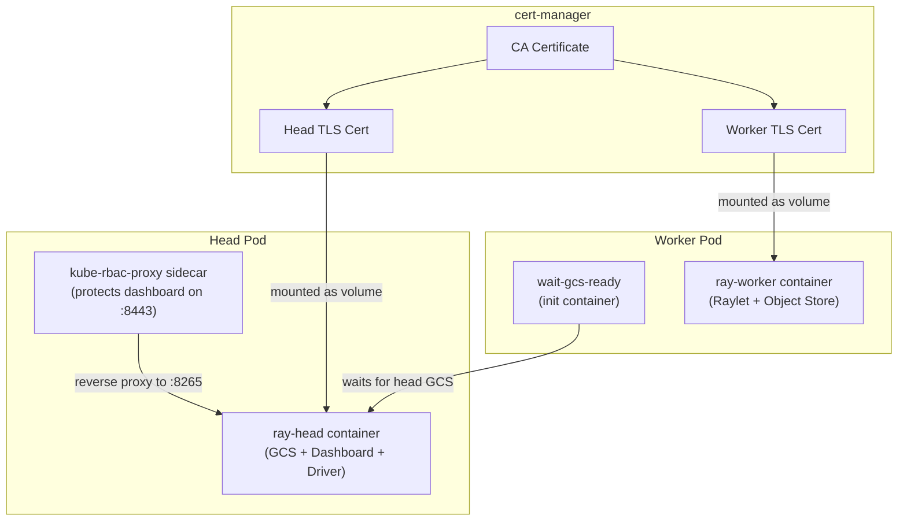

# Module 4: Deploying a RayCluster

## Learning Objectives

By the end of this module you will understand:

- The anatomy of a RayCluster spec and what each field controls
- How RHOAI adds mTLS and kube-rbac-proxy to your pods
- The AuthenticationReady workaround required in RHOAI 3.4.1
- How to verify the cluster with distributed tasks

## Concept: Anatomy of a RayCluster Pod

When you create a `RayCluster`, the KubeRay operator creates pods that look different from what you might expect. RHOAI adds security layers:



| Component | Purpose |
|-----------|---------|
| **ray-head container** | Runs GCS (metadata service), the Ray dashboard, and acts as the driver for job submission. Set `num-cpus: 0` to prevent Ray from scheduling tasks here. |
| **kube-rbac-proxy sidecar** | An OpenShift-injected reverse proxy that sits in front of the Ray dashboard (port 8265). It requires a `ConfigMap` with RBAC authorization rules. |
| **wait-gcs-ready init container** | On worker pods, waits up to 120 seconds for the head node's GCS to become available before starting the Raylet. |
| **TLS certificates** | cert-manager generates a CA cert, a head cert, and a worker cert. These are mounted at `/home/ray/workspace/tls/` and referenced by `RAY_USE_TLS` environment variables. |

## Concept: Why 2Gi Memory for the Head?

The Ray head runs GCS, the dashboard, and a metrics exporter simultaneously. With less than 2Gi, the container gets OOMKilled (exit code 137). The workers can be lighter because they only run the Raylet and object store.

## Step 1: Deploy the RayCluster

```bash
oc apply -k manifests/raycluster/
```

This creates two resources:

1. **RayCluster** (`demo-cluster`) -- 1 head + 1 worker with the tested `quay.io/modh/ray:2.47.1-py311-cu121` image
2. **ConfigMap** (`kube-rbac-proxy-config-demo-cluster`) -- RBAC rules for the kube-rbac-proxy sidecar

:::warning Image version matters
The image tag must match `rayVersion` in the spec. RHOAI 3.4 default images are:
- Python 3.11: `quay.io/modh/ray:2.47.1-py311-cu121`
- Python 3.9: `quay.io/modh/ray:2.35.0-py39-cu121`

Using a non-existent tag (like `2.41.0-py311-cu124`) causes `ImagePullBackOff`.
:::

### Key Spec Fields Explained

```yaml
spec:
  rayVersion: '2.47.1'            # Must match image tag
  headGroupSpec:
    rayStartParams:
      dashboard-host: '0.0.0.0'   # Bind dashboard to all interfaces
      num-cpus: '0'               # Reserve head for coordination only
    template:
      spec:
        containers:
          - name: ray-head
            image: quay.io/modh/ray:2.47.1-py311-cu121
            resources:
              requests:
                cpu: "100m"        # Minimal request for scheduling
                memory: "2Gi"      # Minimum for GCS + Dashboard
              limits:
                memory: "4Gi"      # Headroom for spikes
  workerGroupSpecs:
    - replicas: 1                  # Initial worker count
      minReplicas: 1               # Autoscaler floor
      maxReplicas: 4               # Autoscaler ceiling
```

## Step 2: Apply the AuthenticationReady Workaround

RHOAI 3.4.1 has a known issue where pods never start because the `AuthenticationReady` condition is not set. See [Module 7 -- Troubleshooting](07-troubleshooting) for the full root cause.

```bash
./scripts/fix-auth.sh ray-demo demo-cluster
```

:::info What this script does
1. Reads `metadata.generation` from the RayCluster (e.g., `2`)
2. Patches the status subresource to add `AuthenticationReady: True` with `observedGeneration: 2`
3. Creates the `kube-rbac-proxy-config-demo-cluster` ConfigMap (needed for the head pod sidecar)
:::

## Step 3: Verify

```bash
oc get pods -n ray-demo -w
```

Expected output after 2-3 minutes:

```
NAME                                READY   STATUS    AGE
demo-cluster-head-xxxxx             2/2     Running   3m
demo-cluster-workers-worker-xxxxx   1/1     Running   3m
```

The head pod shows `2/2` because it has two containers: `ray-head` and `kube-rbac-proxy`.

```bash
oc get raycluster -n ray-demo
```

```
NAME           DESIRED WORKERS   AVAILABLE WORKERS   STATUS   AGE
demo-cluster   1                 1                   ready    3m
```

## Step 4: Test with Distributed Tasks

```bash
./scripts/test-cluster.sh ray-demo demo-cluster
```

Or manually:

```bash
oc exec -it $(oc get pods -n ray-demo -l ray.io/node-type=head -o name) \
  -n ray-demo -c ray-head -- python3 -c "
import ray, socket
ray.init(address='auto')
print('Nodes:', len(ray.nodes()))
print('Resources:', ray.cluster_resources())

@ray.remote
def hello(x):
    return f'Task {x} on {socket.gethostname()}'

print(ray.get([hello.remote(i) for i in range(4)]))
ray.shutdown()
"
```

## Step 5: Access the Ray Dashboard (Optional)

```bash
oc port-forward svc/demo-cluster-head-svc -n ray-demo 8265:8265
```

Open http://localhost:8265. The dashboard shows connected nodes, submitted jobs, and resource utilization.

:::tip Dashboard authentication
The kube-rbac-proxy sidecar protects the dashboard. When port-forwarding directly to the service (not through the proxy), you bypass RBAC. In production, access should go through the RHOAI gateway.
:::

## Deep Dive

- [RHOAI 3.4 -- Running Ray-based distributed workloads](https://docs.redhat.com/en/documentation/red_hat_openshift_ai_self-managed/3.4/html/working_with_distributed_workloads/running-ray-based-distributed-workloads_distributed-workloads)
- [KubeRay RayCluster documentation](https://docs.ray.io/en/latest/cluster/kubernetes/getting-started/raycluster-quick-start.html)
- [Ray Architecture whitepaper](https://docs.ray.io/en/latest/ray-core/ray-architecture.html)

---

**Next:** [Module 5 -- RayJob](05-rayjob)
