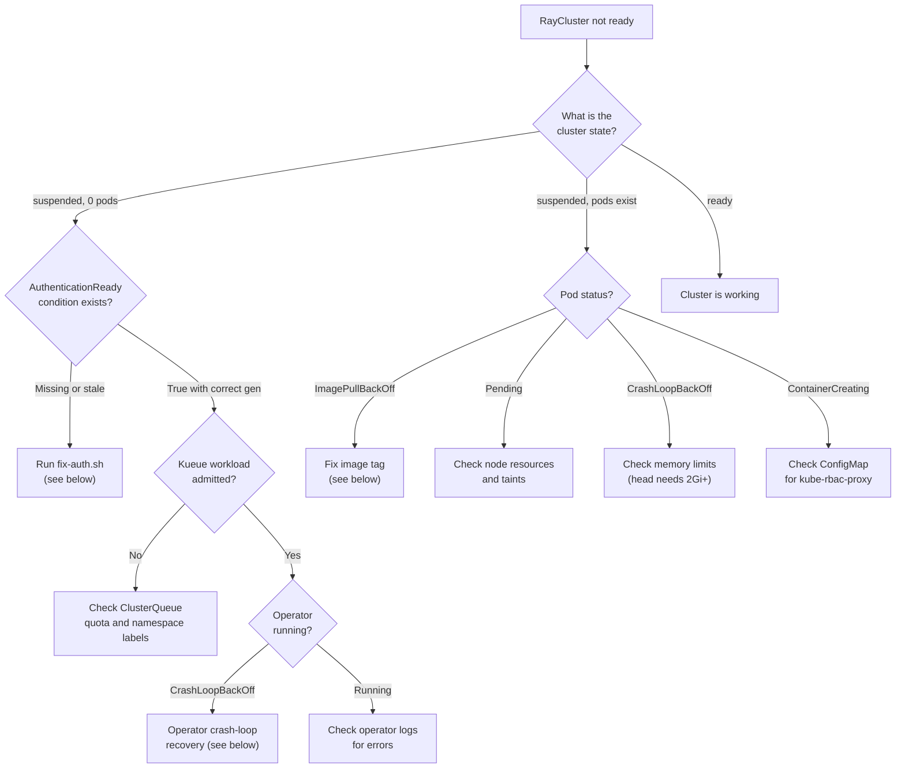
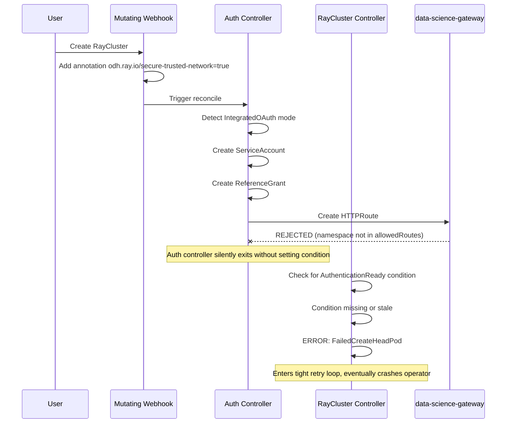

# Module 7: Troubleshooting

## Learning Objectives

By the end of this module you will understand:

- The root cause of the AuthenticationReady bug in RHOAI 3.4.1 and how to fix it
- How to recover from operator crash-loops
- Common image, resource, and scheduling issues and their solutions
- A systematic diagnostic approach for stuck RayClusters

## Diagnostic Decision Tree

When a RayCluster is not working, follow this flow:



## Known Issue: AuthenticationReady (RHOAI 3.4.1)

:::warning Unofficial workaround
This root cause analysis and workaround are based on operational debugging, not official Red Hat documentation. The related official known issue is **RHOAIENG-1795** ("CodeFlare with Ray does not work with Gateway"), which as of RHOAI 3.4.1 has no official workaround. The fix below has been validated on a live RHOAI 3.4.1 cluster.
:::

### Root Cause

This is the most common issue. Here is what happens step by step:



**The core problem:** The `data-science-gateway` only accepts HTTPRoutes from `openshift-ingress` and `redhat-ods-applications` namespaces. User namespaces like `ray-demo` are rejected. The auth controller creates an HTTPRoute in the user namespace, it gets rejected, and the `AuthenticationReady` condition is never set.

### Symptoms

- RayCluster stuck in `suspended` state with 0 pods
- Operator logs show:
  ```
  FailedCreateHeadPod
  waiting for AuthenticationReady condition: Waiting for AuthenticationController to create authentication resources
  ```
- Or: `Condition is stale (observedGeneration=0, currentGeneration=2)`

### Fix

```bash
./scripts/fix-auth.sh ray-demo demo-cluster
```

This script:
1. Reads `metadata.generation` from the RayCluster
2. Sets `AuthenticationReady: True` with the correct `observedGeneration` via the status subresource
3. Creates the `kube-rbac-proxy-config-<name>` ConfigMap

:::warning For RayJobs too
Ephemeral RayJobs create a **child RayCluster** that also needs this fix. Get the child name with:
```bash
oc get rayjob <name> -n ray-demo -o jsonpath='{.status.rayClusterName}'
```
Then run `fix-auth.sh` on that child cluster.
:::

## Operator Crash-Loop Recovery

### Root Cause

When a RayCluster has the AuthenticationReady issue, the main controller enters a tight retry loop (reconciling every ~100ms). This can cause the operator to exceed memory limits or fail liveness probes, leading to `CrashLoopBackOff`. When the operator crashes, its webhook goes down, which blocks any RayCluster patch operations (including removing finalizers to delete the stuck cluster).

### Fix

The recovery procedure must be executed in this exact order:

```bash
# 1. Temporarily set webhook to Ignore mode
#    WHY: the operator is down, so the webhook has no endpoints.
#    Any attempt to patch a RayCluster will fail with "no endpoints available".
oc get mutatingwebhookconfigurations kuberay-mutating-webhook-configuration -o json | \
  python3 -c "import sys,json; o=json.load(sys.stdin); \
  [w.__setitem__('failurePolicy','Ignore') for w in o.get('webhooks',[]) \
  if w.get('name')=='mraycluster.kb.io']; json.dump(o,sys.stdout)" | \
  oc replace -f -

# 2. Remove finalizers from stuck RayClusters
#    WHY: the finalizer blocks deletion. The auth controller would normally
#    remove it during cleanup, but it cannot run while the operator is down.
oc get raycluster -n <namespace> --no-headers -o name | \
  xargs -r -I{} oc patch {} -n <namespace> --type=json \
  -p='[{"op":"replace","path":"/metadata/finalizers","value":[]}]'

# 3. Delete the stuck resources
oc delete raycluster --all -n <namespace> --wait=false

# 4. Clean dead operator pods
oc get pods -n redhat-ods-applications --no-headers | \
  grep kuberay | grep -v Running | awk '{print $1}' | \
  xargs -r oc delete pod -n redhat-ods-applications --force --grace-period=0

# 5. CRITICAL: Restore the webhook
#    WHY: leaving it on Ignore disables admission validation for all RayClusters.
oc get mutatingwebhookconfigurations kuberay-mutating-webhook-configuration -o json | \
  python3 -c "import sys,json; o=json.load(sys.stdin); \
  [w.__setitem__('failurePolicy','Fail') for w in o.get('webhooks',[]) \
  if w.get('name')=='mraycluster.kb.io']; json.dump(o,sys.stdout)" | \
  oc replace -f -
```

Or use the provided script:

```bash
./scripts/cleanup.sh ray-demo
```

## Image Pull Errors

### Symptom

```
Failed to pull image "quay.io/modh/ray:2.41.0-py311-cu124": manifest unknown
```

### Root Cause

The image tag does not exist on `quay.io/modh/ray`. RHOAI 3.4 ships these default images:

| Python | Image | CUDA |
|--------|-------|------|
| 3.9 | `quay.io/modh/ray:2.35.0-py39-cu121` | 12.1 |
| 3.11 | `quay.io/modh/ray:2.47.1-py311-cu121` | 12.1 |

:::warning Image size
These images are approximately **10.9 GB**. On nodes with limited ephemeral storage, pulling them can trigger `DiskPressure` taints and pod eviction. Ensure your nodes have at least 20 GB of free ephemeral storage.
:::

## kube-rbac-proxy ConfigMap Missing

### Symptom

```
MountVolume.SetUp failed for volume "kube-rbac-proxy-config-<name>":
configmap "kube-rbac-proxy-config-<name>" not found
```

### Root Cause

The RHOAI KubeRay operator injects a kube-rbac-proxy sidecar into the head pod but does not always create the required ConfigMap. The `fix-auth.sh` script creates it automatically.

### Manual Fix

```bash
cat <<EOF | oc apply -f -
apiVersion: v1
kind: ConfigMap
metadata:
  name: kube-rbac-proxy-config-<cluster-name>
  namespace: <namespace>
data:
  config.yaml: |
    authorization:
      resourceAttributes:
        apiGroup: ray.io
        apiVersion: v1
        resource: rayclusters
        name: <cluster-name>
        namespace: <namespace>
EOF
```

## Node Resource Exhaustion

### Symptom

```
0/8 nodes are available: 2 Insufficient cpu, 2 node(s) had untolerated taint
{node.kubernetes.io/disk-pressure: }
```

### Diagnosis

```bash
# Check all node resources and taints
oc get nodes -o custom-columns=\
'NAME:.metadata.name,CPU:.status.allocatable.cpu,DISK-PRESSURE:.status.conditions[?(@.type=="DiskPressure")].status,TAINTS:.spec.taints[*].key'

# Check CPU usage on a specific node
oc describe node <node-name> | grep -A5 'Allocated resources:'
```

### Solutions

- **Scale up:** `oc scale machineset <name> -n openshift-machine-api --replicas=<N>`
- **Reduce requests:** Lower `resources.requests.cpu` in your RayCluster spec (100m is sufficient for demo workloads)
- **Tolerate GPU nodes:** Add `tolerations` for `nvidia.com/gpu` taint if GPU nodes have spare CPU
- **Wait for disk pressure:** Check ephemeral storage with `df -h` on the node; the 10.9 GB Ray image is often the cause

## Head Pod OOMKilled (Exit Code 137)

### Symptom

The `ray-head` container restarts with exit code 137 and reason `Error`.

### Root Cause

The Ray head runs GCS, the dashboard, metrics exporter, and a Raylet simultaneously. With less than 2 GiB memory, these processes exceed the container limit and are killed by the OOM killer.

### Fix

Set memory requests to at least 2 GiB and limits to 4 GiB:

```yaml
resources:
  requests:
    memory: "2Gi"
  limits:
    memory: "4Gi"
```

---

**Back to:** [Workshop Home](01-overview)
